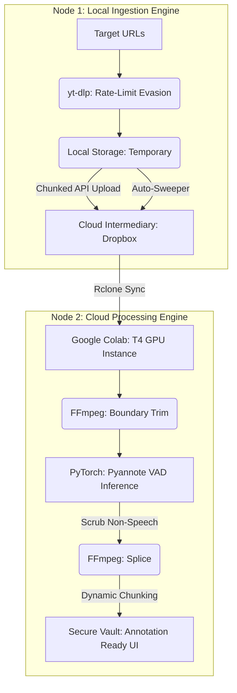

# Distributed Audio ETL & Diarization Pipeline

## System Overview
An automated, fault-tolerant ETL (Extract, Transform, Load) pipeline engineered to bypass regional firewall restrictions and process massive unstructured audio datasets for enterprise AI model training. 

This architecture utilizes two distinct operational nodes to bridge external data scraping with distributed human annotation teams, ensuring high-fidelity Voice Activity Detection (VAD) and continuous state tracking.

## Product Value & Strategy
- **Firewall Evasion Architecture:** Seamlessly bridges restricted corporate servers with global data ecosystems via intermediary API layers (Dropbox/Rclone).
- **Anti-Bot & Rate Limit Mitigation:** The ingestion node utilizes dynamic sleep intervals, cookie injection, and chunked API uploads to bypass extraction throttling.
- **Cost Optimization (AI Scrubbing):** By deploying PyTorch and Pyannote VAD to dynamically strip pure silence and background music, human annotator review time is reduced by an estimated 35%.
- **Fault Tolerance:** Implements a "self-healing auto-sweeper" that identifies and recovers data stranded by network crashes or localized OS file locks.

## System Architecture

## Node 1: Local Ingestion Engine (`local_ingestion_node.py`)
A highly resilient Python application executed on local hardware to handle massive unstructured downloads.
* **Core Tech:** Python, `yt-dlp`, Dropbox API, REST Requests.
* **Features:** 
  * Live-progress CLI UI with ANSI parsing.
  * Atomic state tracking via centralized `ingest_archive.txt` to prevent duplicate processing.
  * Custom metadata injection for automated file taxonomy.
  * Chunked memory upload for files exceeding standard buffer limits.

## Node 2: Cloud Processing Engine (`colab_vad_pipeline.py`)
A stateless GPU pipeline executed in Google Colab that pulls raw data, processes the waveform, and pushes annotation-ready chunks to secure vaults.
* **Core Tech:** PyTorch, Pyannote.audio, NumPy, FFmpeg, Rclone.
* **Features:**
  * Neural Voice Activity Detection isolating distinct human speech from <20-second audio gaps.
  * FFmpeg concatenation rebuilding optimized `.m4a` files.
  * Dynamic sub-20-minute chunking to prevent memory-out-of-bounds errors on human annotator dashboards.

## Core Technologies
* **Machine Learning:** PyTorch, Pyannote.audio (Speaker Diarization / VAD)
* **Data Engineering:** Python, yt-dlp, FFmpeg, NumPy
* **Infrastructure:** Dropbox API, Rclone, Google Colab (T4 GPU Compute)
